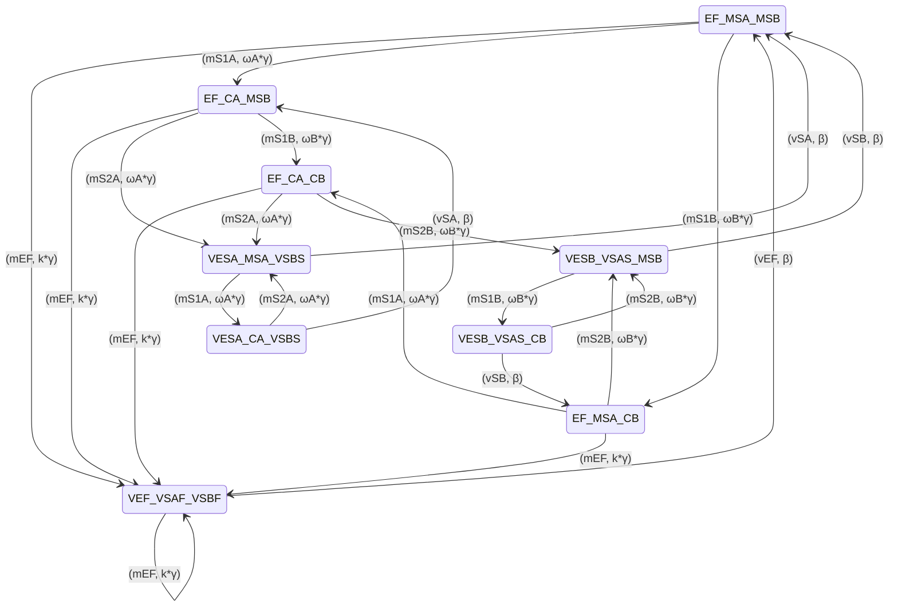
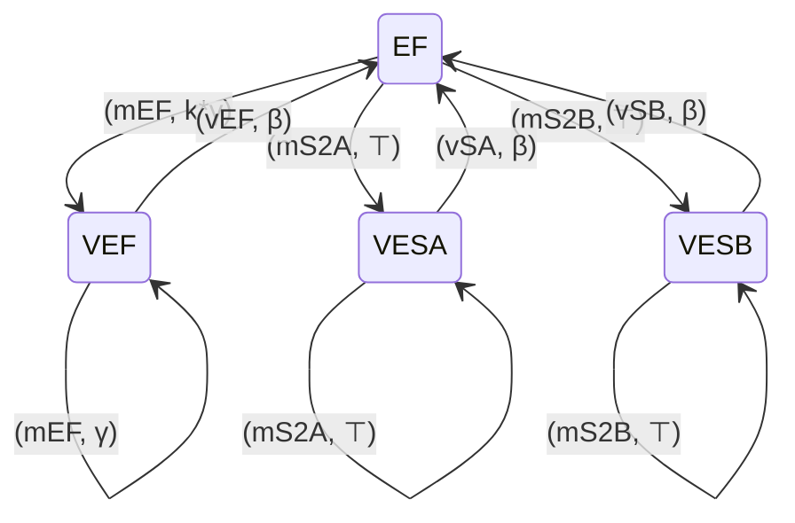
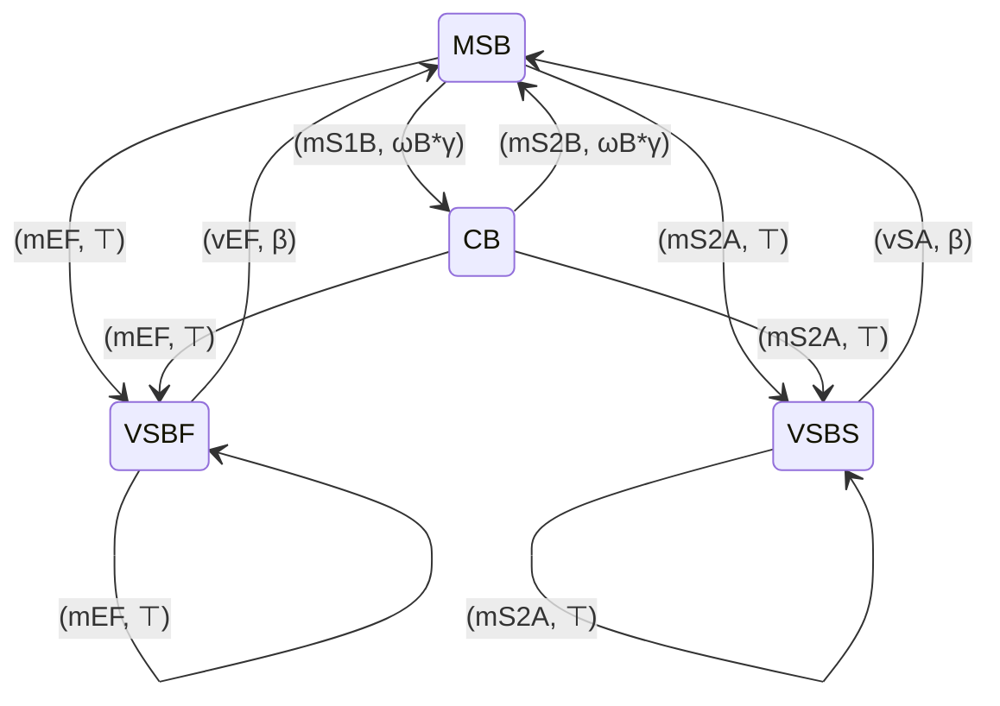

```mermaid
stateDiagram-v2
    EF_MSA_MSB
    EF_CA_MSB
    EF_MSA_CB
    VEF_VSAF_VSBF
    VESA_MSA_VSBS
    EF_CA_CB
    VESB_VSAS_MSB
    VESA_CA_VSBS
    VESB_VSAS_CB

    EF_MSA_MSB --> VEF_VSAF_VSBF: (mEF, k*γ)
    EF_MSA_MSB --> EF_CA_MSB: (mS1A, ωA*γ)
    EF_MSA_MSB --> EF_MSA_CB: (mS1B, ωB*γ)

    EF_CA_CB --> VEF_VSAF_VSBF: (mEF, k*γ)
    EF_CA_CB --> VESA_MSA_VSBS: (mS2A, ωA*γ)
    EF_CA_CB --> VESB_VSAS_MSB: (mS2B, ωB*γ)
    
    EF_CA_MSB --> VEF_VSAF_VSBF: (mEF, k*γ)
    EF_CA_MSB --> VESA_MSA_VSBS: (mS2A, ωA*γ)
    EF_CA_MSB --> EF_CA_CB: (mS1B, ωB*γ)

    EF_MSA_CB --> VEF_VSAF_VSBF: (mEF, k*γ)
    EF_MSA_CB --> VESB_VSAS_MSB: (mS2B, ωB*γ)
    EF_MSA_CB --> EF_CA_CB: (mS1A, ωA*γ)

    VESA_MSA_VSBS --> EF_MSA_MSB: (vSA, β)
    VESA_MSA_VSBS --> VESA_CA_VSBS: (mS1A, ωA*γ)
    
    VESB_VSAS_MSB --> EF_MSA_MSB: (vSB, β)
    VESB_VSAS_MSB --> VESB_VSAS_CB: (mS1B, ωB*γ)

    VESA_CA_VSBS --> EF_CA_MSB: (vSA, β)
    VESA_CA_VSBS --> VESA_MSA_VSBS: (mS2A, ωA*γ)

    VESB_VSAS_CB --> EF_MSA_CB: (vSB, β)
    VESB_VSAS_CB --> VESB_VSAS_MSB: (mS2B, ωB*γ)

    VEF_VSAF_VSBF --> EF_MSA_MSB: (vEF, β)
    VEF_VSAF_VSBF --> VEF_VSAF_VSBF: (mEF, k*γ)
```

```mermaid
stateDiagram-v2
    EF --> VEF: (mEF, k*γ)
    EF --> VESA: (mS2A, ⊤)
    EF --> VESB: (mS2B, ⊤)

    VEF --> EF: (vEF, β)
    VEF --> VEF: (mEF, γ)

    VESA --> EF: (vSA, β)
    VESA --> VESA: (mS2A, ⊤)

    VESB --> EF: (vSB, β)
    VESB --> VESB: (mS2B, ⊤)
```

```mermaid
stateDiagram-v2
    MSA --> VSAF: (mEF, ⊤)
    MSA --> VSAS: (mS2B, ⊤)
    MSA --> CA: (mS1A, ωA*γ)

    VSAF --> MSA: (vEF, β)
    VSAF --> VSAF: (mEF, ⊤)

    VSAS --> MSA: (vSB, β)
    VSAS --> VSAS: (mS2B, ⊤)

    CA --> MSA: (mS2A, ωA*γ)
    CA --> VSAF: (mEF, ⊤)
    CA --> VSAS: (mS2B, ⊤)
```

```mermaid
stateDiagram-v2
    MSB --> VSBF: (mEF, ⊤)
    MSB --> VSBS: (mS2A, ⊤)
    MSB --> CB: (mS1B, ωB*γ)

    VSBF --> MSB: (vEF, β)
    VSBF --> VSBF: (mEF, ⊤)

    VSBS --> MSB: (vSA, β)
    VSBS --> VSBS: (mS2A, ⊤)

    CB --> MSB: (mS2B, ωB*γ)
    CB --> VSBF: (mEF, ⊤)
    CB --> VSBS: (mS2A, ⊤)
```